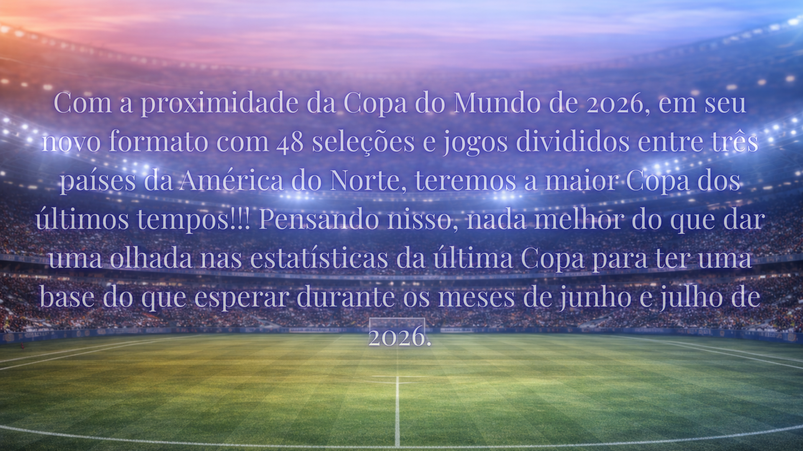

# **Fifa World Cup 2022: Complete Dataset** ⚽ 

## Did you all miss the World Cup? 
### About the Dataset ###
#### ***This dataset contains all the matches, updated daily, of the Qatar Fifa World Cup 2022.***
### Inspiration ###
#### ***As the 2026 World Cup takes place this year, this dataset provides an excellent opportunity for match analysis. With a wide array of features available, it supports not only diverse exploratory data analysis techniques but also a variety of plots and visualization methods. Python libraries, in particular, make these tasks both efficient and versatile.*** ####
> ##### Database

> ##### Programming Language

## O Projeto

   

## Facilitadores do Projeto - Grupo 45

|   ID       | Nome              | Atividade                                                          |
| ---------- | ------------------| ------------------------------------------------------------------ |
| ASD        | Reinaldo Oliveira |                                                                    |                 
| 1142184360 | Douglas Lucena    |                                                                    |
| ASD        | Luan Dias         |                                                                    |
| 1141910979 | Arthur Medeiros   |                                                                    |

## Cronograma do Projeto

   

